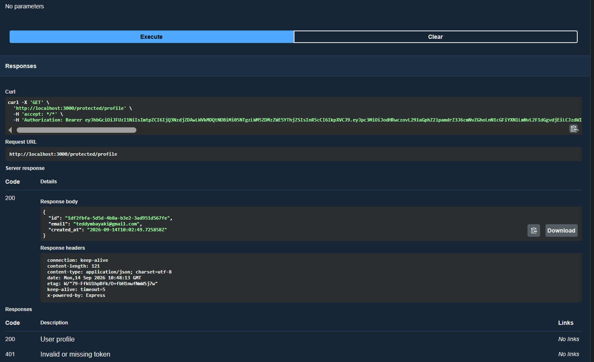

# Task API

A CRUD API for managing a to-do list, secured with Supabase Auth, backed by PostgreSQL, and fully containerized with Docker. Built as part of the FlyRank Backend AI Engineering internship (Assignments A1–A4).

This project has evolved through four assignments: in-memory storage (A1) → SQLite (A2) → containerized Postgres (A3) → authentication with Supabase (A4, current). The core task CRUD API has stayed the same throughout; this stage adds real user accounts and protects routes behind verified JWTs.

## Install & Run

**Requires Docker Desktop and a free Supabase account.**

1. Create a free project at [supabase.com](https://supabase.com)
2. Under Project Settings → API, copy your Project URL and publishable (anon) key
3. Under Authentication → Sign In / Providers → Email, turn off "Confirm email" for easier local testing
4. Copy `.env.example` to `.env` and fill in your Supabase values:

```bash
cp .env.example .env
```

5. Start the stack:

```bash
docker compose up
```

The server runs on `http://localhost:3000`. Postgres data is seeded automatically; user accounts are managed entirely by Supabase.

## Environment variables

See `.env.example`:

```
SUPABASE_URL=your_project_url
SUPABASE_KEY=your_publishable_key
PORT=3000
DATABASE_URL=postgres://postgres:dev@db:5432/tasks
```

## Endpoints

| Method | Path                  | Description               | Auth required |
|--------|-----------------------|----------------------------|----------------|
| POST   | `/auth/signup`        | Create a new user account  | No             |
| POST   | `/auth/login`         | Log in, get a JWT          | No             |
| POST   | `/auth/logout`        | End the session             | Yes (Bearer)   |
| GET    | `/public/info`        | Open, public info           | No             |
| GET    | `/protected/profile`  | Logged-in user's profile    | Yes (Bearer)   |
| GET    | `/protected/dashboard`| Example second protected route | Yes (Bearer) |
| GET    | `/tasks`              | List all tasks              | No             |
| GET    | `/tasks/:id`          | Get a single task           | No             |
| POST   | `/tasks`              | Create a new task           | No             |
| PUT    | `/tasks/:id`          | Update a task                | No             |
| DELETE | `/tasks/:id`          | Delete a task                | No             |

## Example requests

**Sign up:**
```
$ curl -i -X POST http://localhost:3000/auth/signup \
  -H "Content-Type: application/json" \
  -d '{"email":"you@example.com","password":"yourpassword"}'

HTTP/1.1 201 Created
```

**Log in:**
```
$ curl -i -X POST http://localhost:3000/auth/login \
  -H "Content-Type: application/json" \
  -d '{"email":"you@example.com","password":"yourpassword"}'

HTTP/1.1 200 OK
{"access_token":"eyJ...","refresh_token":"..."}
```

**Access a protected route:**
```
$ curl -i http://localhost:3000/protected/profile \
  -H "Authorization: Bearer <your_access_token>"

HTTP/1.1 200 OK
{"id":"...","email":"you@example.com","created_at":"..."}
```

## Swagger UI

Interactive API docs, including a Bearer "Authorize" flow for protected routes, available at `http://localhost:3000/docs`.



## Authentication

This project uses [Supabase Auth](https://supabase.com/docs/guides/auth) as the identity provider — no passwords are hashed or stored by this application. The flow:

1. Client signs up or logs in via `/auth/signup` / `/auth/login`, forwarded to Supabase
2. Supabase returns a signed JWT (`access_token`)
3. Client includes that token as `Authorization: Bearer <token>` on protected routes
4. The server verifies the token with Supabase (`supabase.auth.getUser(token)`) via reusable middleware before allowing access

A tampered or expired token is rejected with `401`.

## Database

Data is stored in PostgreSQL, running in its own Docker container, with a named volume (`taskdata`) so data survives a full stack restart.

## Notes

- `.env` holds real secrets (Supabase keys, DB connection string) and is git-ignored — never committed.
- `.env.example` is committed with placeholder values so anyone cloning the repo knows what to configure.