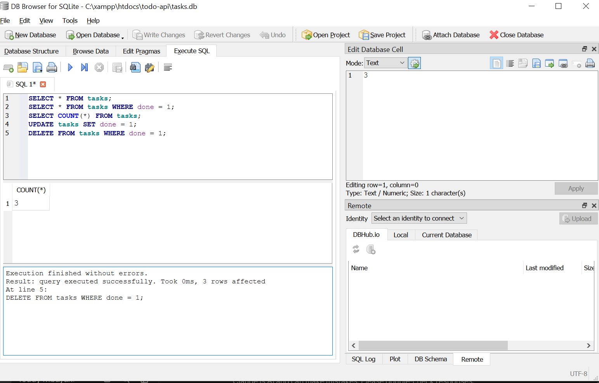

# Task API

A CRUD API for managing a to-do list, built with Node.js and Express, backed by a SQLite database. Built as part of the FlyRank Backend AI Engineering internship (Week 2–3, Assignments A1 & A2).

## Install & Run

```bash
npm install
node index.js
```

The server starts on `http://localhost:3000`. A `tasks.db` SQLite file is created automatically on first run, seeded with 3 example tasks.

## Endpoints

| Method | Path         | Description             |
|--------|--------------|--------------------------|
| GET    | `/`          | API info                |
| GET    | `/health`    | Health check             |
| GET    | `/tasks`     | List all tasks           |
| GET    | `/tasks/:id` | Get a single task        |
| POST   | `/tasks`     | Create a new task        |
| PUT    | `/tasks/:id` | Update a task            |
| DELETE | `/tasks/:id` | Delete a task            |

## Example request

```
$ curl -i http://localhost:3000/tasks/1

HTTP/1.1 200 OK
Content-Type: application/json; charset=utf-8

{"id":1,"title":"Buy milk","done":0}
```

## Swagger UI

Interactive API docs available at `http://localhost:3000/docs`.


## Database

Data is stored in a SQLite database (`tasks.db`), not in memory — tasks survive a server restart.

**Why SQLite?** It's a single file with no separate server to install or configure, making it ideal for a small project like this. The whole database is just `tasks.db`, created automatically the first time the app runs.

The database file is git-ignored, so a fresh clone starts with a clean, auto-seeded database rather than shipping a pre-existing file.

### Example SQL query

```sql
DELETE FROM tasks WHERE done = 1;
```

Run by hand in DB Browser for SQLite after marking all tasks done — it removed every row from the table. Hitting the API's `GET /tasks` immediately afterward (no server restart) returned an empty array, showing the API and DB Browser read the exact same file with no syncing needed.



## Notes

Data now persists across restarts using SQLite — this replaces the in-memory storage used in the earlier version of this project.

## Database (Postgres via Docker)

Run Postgres in a container:

\`\`\`bash
docker run --name taskdb -e POSTGRES_PASSWORD=dev -e POSTGRES_DB=tasks -p 5432:5432 -v taskdata:/var/lib/postgresql/data -d postgres:16
\`\`\`