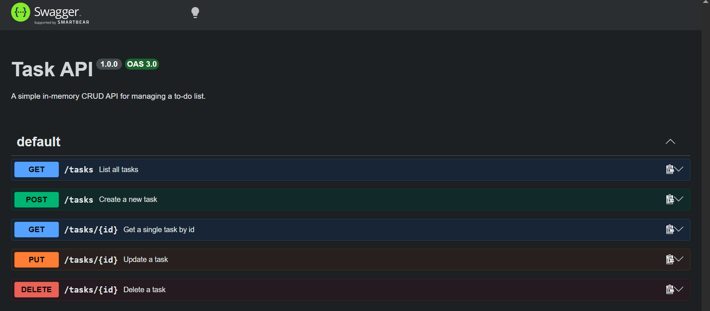
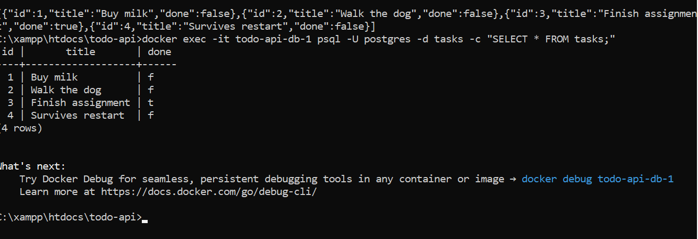

# Task API

A CRUD API for managing a to-do list, built with Node.js and Express, backed by PostgreSQL and fully containerized with Docker. Built as part of the FlyRank Backend AI Engineering internship (Assignments A1, A2, and A3).

This project has gone through three storage layers as the assignments progressed: an in-memory array (A1) → a SQLite file (A2) → a containerized Postgres database (A3, current). The API and its behavior stayed identical throughout — only the storage underneath changed.

## Install & Run

**Requires Docker Desktop.**

```bash
cp .env.example .env
docker compose up
```

That's it — this builds the app image, starts Postgres in its own container, waits for it to be healthy, then starts the API. The server runs on `http://localhost:3000`, and the `tasks` table is created and seeded automatically on first run.

To stop everything: `docker compose down` (your data persists in a named volume — it'll still be there next time you run `docker compose up`).

## Environment variables

See `.env.example` for the required variable:

```
DATABASE_URL=postgres://postgres:dev@db:5432/tasks
```

(Inside Docker Compose, the app reaches Postgres via the service name `db`, not `localhost`.)

## Endpoints

| Method | Path         | Description             |
|--------|--------------|--------------------------|
| GET    | `/`          | API info                |
| GET    | `/health`    | Health check             |
| GET    | `/tasks`     | List all tasks           |
| GET    | `/tasks/:id` | Get a single task        |
| POST   | `/tasks`     | Create a new task        |
| PUT    | `/tasks/:id` | Update a task            |
| DELETE | `/tasks/:id` | Delete a task            |

## Example request

```
$ curl -i http://localhost:3000/tasks/1

HTTP/1.1 200 OK
Content-Type: application/json; charset=utf-8

{"id":1,"title":"Buy milk","done":false}
```

## Swagger UI

Interactive API docs available at `http://localhost:3000/docs`.



## Database

Data is stored in PostgreSQL, running in its own Docker container, with a named volume (`taskdata`) so data survives even a full `docker compose down` + `up`.

**Why Postgres + Docker?** Postgres is the same production-grade database engine used by real-world backends. Running it in a container means no local install, no version conflicts, and the exact same setup on any machine — "works on my machine" stops being a problem.

`.env` holds the real connection string and is git-ignored; `.env.example` is committed with the variable name so anyone cloning the repo knows what to set.

### Viewing the data directly

```bash
docker exec -it todo-api-db-1 psql -U postgres -d tasks -c "SELECT * FROM tasks;"
```



## Notes

- **A1 → A2:** moved storage from an in-memory array to a SQLite file (`tasks.db`), so data survived a server restart.
- **A2 → A3:** moved storage from SQLite to a containerized PostgreSQL database, and wrapped the whole app + database with Docker Compose so the entire stack starts with one command. Data now survives not just a server restart, but a full container teardown, thanks to a persistent volume.
- All three versions expose the exact same API — proving that storage is an implementation detail the client never needs to know about.